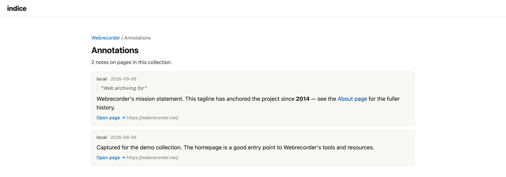

Annotations let people add notes to the pages in an archive. A note is pinned to a **specific capture** (a URL at a timestamp) and can cover the **whole page** or a **selected passage**. It's freeform [Markdown](#markdown), it's **public to read**, and only a signed-in user can create one.

Where finding aids and crawl provenance describe a collection or a crawl, annotations carry that descriptive impulse down to the individual page — a curator flagging why a capture matters, noting what's missing, or connecting it to the rest of the record. (The framing is Michèle Valerie Cloonan and Ross Harvey's lineage and, directly, Light & Hyry's *Colophons and Annotations*; see the [design notes](https://github.com/edsu/indice/blob/main/DESIGN.md).)

:::note
Annotations are stored in the clear as Markdown, and display is **public**. Don't put anything private in a note.
:::

## Who can annotate

Reading annotations is open to everyone. **Creating, editing, and deleting** them requires management access — the same gate as the rest of the [workroom](/docs/guides/manage/):

- **Local `serve --manage`** on loopback — you're the trusted admin; notes are authored as `local`.
- **Behind a forward-auth proxy** — the authenticated user is the author, and their identity is shown as the note's author.

You can edit or delete **only your own** notes.

## Creating a note

Open any archived page in the replay viewer. With management on, a **Notes** panel is available beside the page (toggle it from the banner):

- **Note on this page** — a note about the whole capture.
- **Note on selection** — select some text in the replayed page first, then add a note anchored to that passage. The selected text is stored as a [quote selector](#how-a-note-finds-its-passage) so it can be re-found and highlighted on future visits.

Notes are written in Markdown and saved immediately — no rebuild or restart. A passage note shows its quoted text; on replay, the passage is **highlighted in place** in the page.


## Where notes show up

A note you write is surfaced in several places:

- **The replay panel** — every note on the current capture, with passage notes highlighted in the page.
- **The collection annotations index** — a per-collection browse at `/collection/<id>/annotations`, linked from the collection page, listing every note with its author, quoted passage, and a link back into replay.
- **Full-text search** — each note is indexed as its own result (a "Note by …" row) so a search over the archive turns up relevant notes alongside pages. See [Searching](/docs/guides/searching/).



## Markdown

Note bodies are rendered through the same sanitizing Markdown renderer as collection narratives and crawl notes: headings, emphasis, lists, blockquotes, inline code and code blocks, and links work; raw HTML is escaped, and only `http`/`https`/`mailto` links (and image *alt* text) survive — so a public write surface can't inject scripts.

## How a note finds its passage

A passage note stores a [W3C Web Annotation](https://www.w3.org/TR/annotation-model/) `TextQuoteSelector` — the exact quoted text plus a little surrounding context. On replay, indice re-locates that text in the page and highlights it, so a note keeps pointing at the right passage even though nothing is written back into the archived page itself.

## Where notes are stored

Annotations live in a plain, human-readable file per collection:

```
<home>/collections/<slug>/annotations.jsonl
```

One [W3C Web Annotation](https://www.w3.org/TR/annotation-model/) (JSON-LD) per line, keyed by the capture's URL + timestamp. Because it's a file — not hidden in a database — it's diff-friendly and **committable** to version control alongside the collection's finding aid, and it survives an [`indice reindex`](/docs/reference/cli/). (Adding annotation support changed the search-index schema, so an index built before it needs one `indice reindex`; `serve` will tell you if so.)

## API

Reading notes is part of the public [REST API](/docs/reference/api/) (`GET /api/annotations`); creating, editing, and deleting them are management-gated write endpoints.
