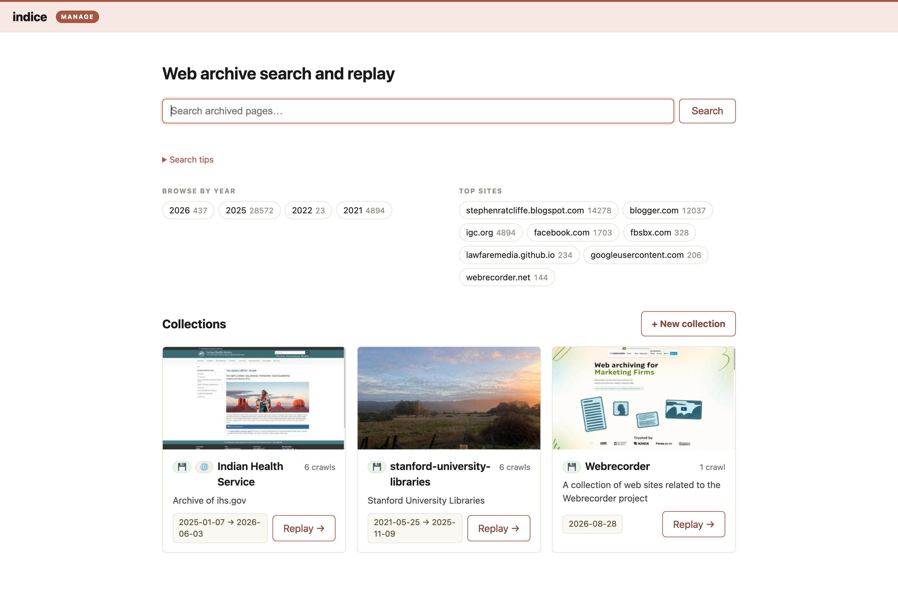
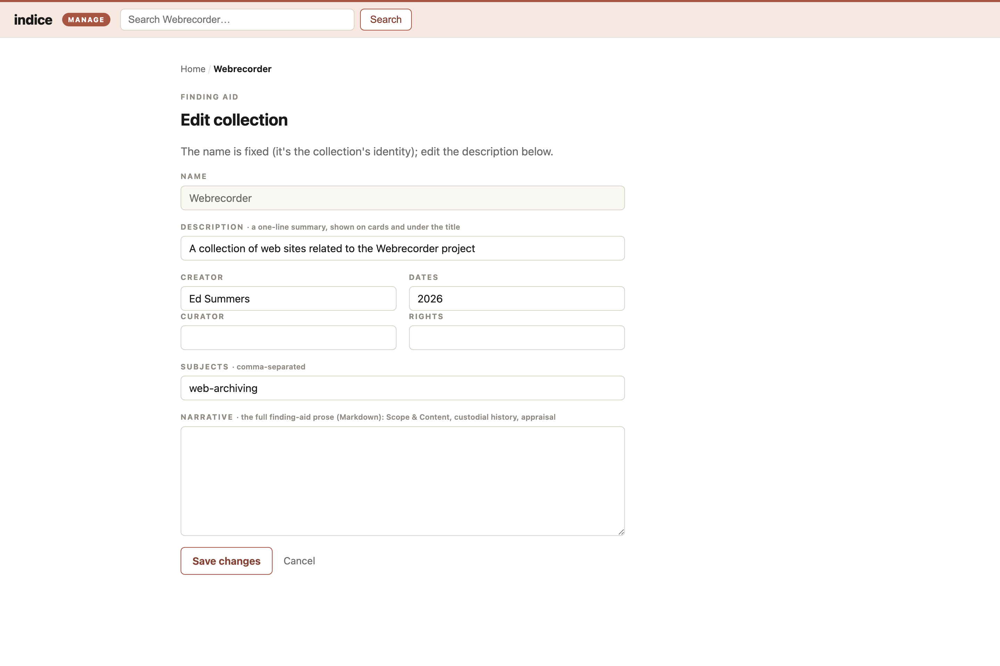
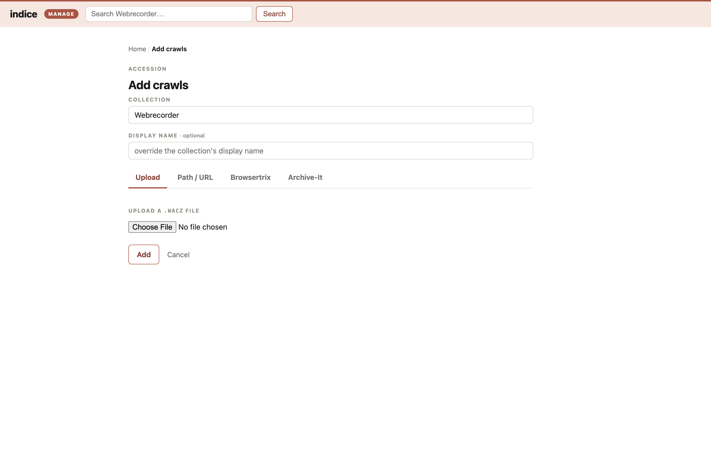

By default `indice serve` is **read-only** — it never writes, so you curate from the command line (`index`, `collection set`, `import browsertrix`). Passing `--manage` turns the ordinary site into an editable **workroom**: the same pages gain curation controls (a warm clay "red-tape" accent marks write mode), so you can add archives and curate collections in place, no command line needed:

```bash
indice serve --manage        # http://127.0.0.1:8080
```



With `--manage` on:

- **The homepage** — its collection list gains a **+ New collection** button, and each card an **Edit** affordance. An empty instance greets you with "add your first archive."
- **Each collection page** — gains **Edit collection** (the finding-aid form: description, creator, dates, rights, subjects, narrative) and **+ Add crawls**.
- **Add crawls** (the accession desk) — upload a `.wacz` from your computer, or point indice at a local path or an `http(s)://` URL. Indexing runs in the background with live progress; when it finishes the crawl is searchable immediately (the server hot-reloads its reader — no restart). Uploaded/local files are copied into `<home>/archive/`; a URL is streamed in place. Browsertrix and Archive-It are additional source tabs: browse the configured account and pick crawls to import, with the same live progress.
- **The replay viewer** — gains a **Notes** panel for [annotating](/docs/guides/annotations/) a page or a selected passage. Notes are public to read but only signed-in users can write them.





The default `serve` (without `--manage`) mounts none of this, so a public, read-only deployment can never mutate the archive.

## Local use

`indice serve --manage` bound to `127.0.0.1` (the default) trusts every request: you're the only one who can reach it, so you're the admin and there's no login. Because it trusts everything, indice **refuses to start** if `--manage` is bound to a non-loopback address without an auth proxy configured (below) — otherwise you'd expose an unauthenticated write surface to the network.

## Running as a service (forward-auth)

To offer management to real users over the network, run indice behind an **authenticating reverse proxy** — nginx, Caddy, [oauth2-proxy](https://oauth2-proxy.github.io/oauth2-proxy/), Authelia, Cloudflare Access, Tailscale, an institutional SSO gateway, and so on. The proxy performs the login and forwards the authenticated user to indice in a header; indice trusts that header only when the request also carries a shared secret:

```bash
indice serve --manage \
  --bind 127.0.0.1:8080 \
  --auth-proxy-header X-Forwarded-Email \
  --auth-proxy-secret "$INDICE_AUTH_PROXY_SECRET"   # or set that env var
```

- **`--auth-proxy-header`** is the header your proxy injects with the authenticated identity (e.g. `X-Forwarded-Email` for oauth2-proxy, `Remote-Email` for Authelia).
- **`--auth-proxy-secret`** (or the `INDICE_AUTH_PROXY_SECRET` env var) is a random secret your **proxy** must send in the `X-Indice-Auth-Secret` header. It is a static header you set in the proxy config — *not* something your identity provider sends. Requiring it is what makes trusting the identity header safe: a client that forges `X-Forwarded-Email`, or any request that didn't come through the proxy, lacks the secret and gets a `403`.

Every management request must carry both the identity header and the secret; anything else is rejected. The public read-only site (search, browse, replay) is **not** gated — only the management routes are. "Who is an admin" is delegated entirely to your proxy/SSO: anyone it logs in can administer.

The management routes show the workroom chrome + signed-in identity from the proxy's identity header. The public pages (home, collection, crawl) are ungated, and browsers won't send the proxy's credentials there — so at login indice sets a small **signed, display-only session cookie** (HMAC'd with the shared secret) and reads it on those pages, so a signed-in admin gets the edit-in-place controls everywhere. The cookie only drives *rendering* — every write is still re-checked against the proxy's identity header + secret, so a stolen or forged cookie grants no access. Pages served without an identity show a **Log in** link (it points at the gated `/manage/login`, so following it trips the proxy's login and returns you to where you were). A **Log out** link clears the display cookie — but note that with the Basic-auth stopgap the browser keeps its cached credentials until it's closed, so logout only hides the chrome; a full sign-out (and single sign-on) comes with the [SSO path](/docs/guides/deploy/#single-sign-on-oauth2-proxy).

### Deploy checklist

- Bind indice to loopback and have the proxy connect to it there, so nothing but the proxy can reach the port.
- Configure the proxy to **strip any client-supplied** identity header on inbound requests before setting its own, so a client can't smuggle one in. (The shared secret is your backstop if this is ever missed.)
- Set the static `X-Indice-Auth-Secret` header in the proxy, and terminate TLS there.

Illustrative Caddy config (adapt directives to your proxy/version):

```text
example.org {
    # 1. require an SSO login (oauth2-proxy talks to your IdP)
    forward_auth 127.0.0.1:4180 {
        uri /oauth2/auth
        copy_headers X-Forwarded-Email          # the authenticated identity
    }
    # 2. proxy to indice, adding the shared secret
    reverse_proxy 127.0.0.1:8080 {
        header_up X-Indice-Auth-Secret {env.INDICE_AUTH_PROXY_SECRET}
    }
}
```

For turnkey Docker Compose overlays that wire this up (Basic auth or GitHub SSO), see [Deploy indice](/docs/guides/deploy/#management-over-the-network).
