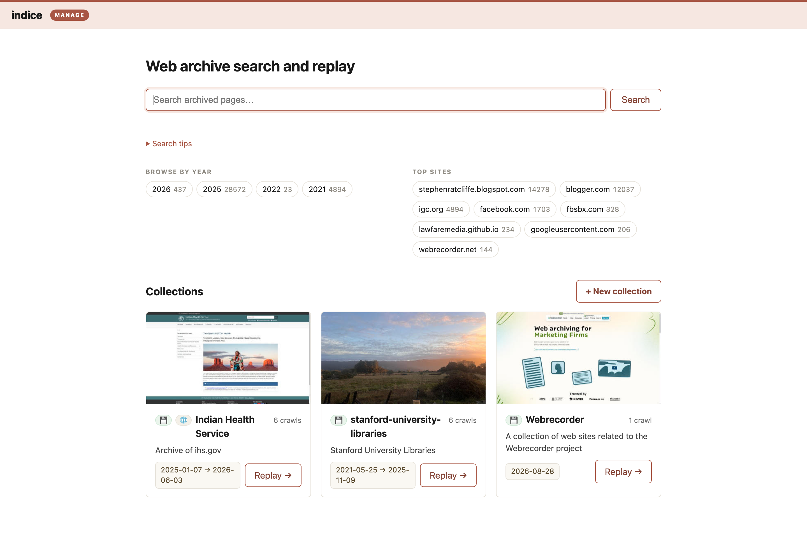
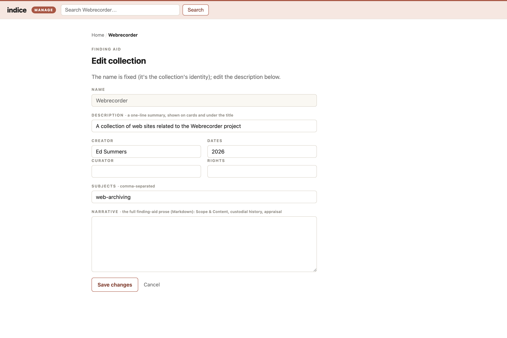
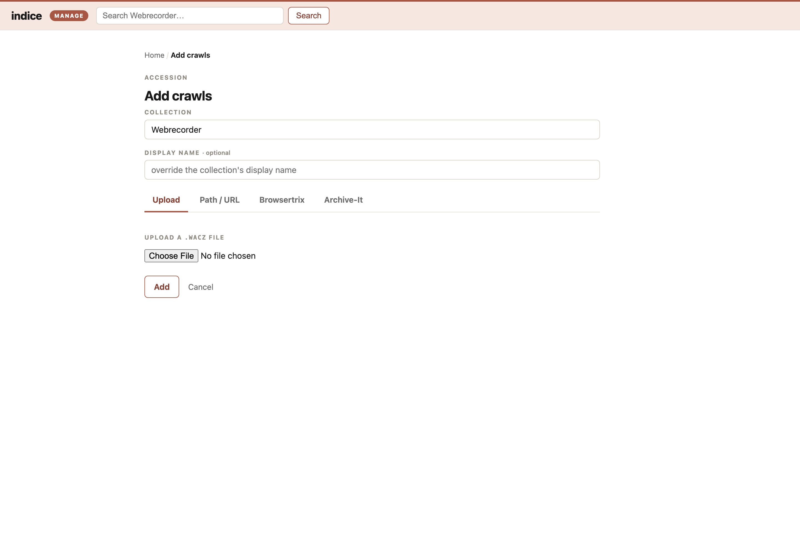

The ordinary site doubles as an editable **workroom**. For anyone allowed to change the archive, the same pages gain curation controls, marked by a warm clay "red-tape" accent, so you can add archives and curate collections in place without the command line:

```bash
indice serve        # http://127.0.0.1:8080
```

On a workstation that is the whole setup. Whoever reaches the port is the operator, so there is no login and no roster. On a server it is `users.yaml` that decides, and a visitor who is not listed sees the reading room.



What the controls are:

- **The homepage.** Its collection list gains a **+ New collection** button, and each card an **Edit** affordance. An empty instance shows "add your first archive."
- **Each collection page** gains **Edit collection** (the finding-aid form: description, creator, dates, rights, subjects, narrative) and **+ Add crawls**.
- **Add crawls** (the accession desk). Upload a `.wacz` from your computer, or point indice at a local path or an `http(s)://` URL. Indexing runs in the background with live progress; when it finishes the crawl is searchable immediately (the server hot-reloads its reader, so no restart is needed). Uploaded/local files are copied into `<home>/archive/`; a URL is streamed in place. Browsertrix and Archive-It are additional source tabs: browse the configured account and pick crawls to import, with the same live progress.
- **The replay viewer** gains a **Notes** panel for [annotating](/docs/guides/annotations/) a page or a selected passage. Notes are public to read but only signed-in users can write them.





Every one of these routes is always mounted. Whether you may use them is an authorization question, answered below, so an anonymous visitor gets a `403` rather than a page that does not exist.

## On a workstation

`indice serve` bound to `127.0.0.1`, which is the default, trusts every caller: you are the only one who can reach it, so you are the admin and there is no login. `users.yaml` is not consulted at all here, which surprises people who write one and expect it to apply.

Because it trusts everything, indice **refuses to start** on a non-loopback address with no auth proxy configured, rather than putting an unauthenticated write surface on the network.

:::caution[A loopback port is not a user boundary]
"Whoever reaches the port" is literal. Another account on the machine reaches it: `curl -X POST http://127.0.0.1:8080/api/collections/x/delete` from a second shell deletes the collection. So does anyone at the far end of an `ssh -L`, and so does every peer of your tailnet the moment you point `tailscale serve` at it.

indice does not try to tell them apart, and the [threat model](https://github.com/edsu/indice/blob/main/DESIGN.md#threat-model) explains why: two versions of a check on the `Host` header were written and both were bypassable, because any client that is not a browser sets `Host` to whatever it likes. A check that refuses the honest tunnel and waves the dishonest one through is worse than none, since it reads like a wall.

A loopback bind keeps indice off the network. That is the whole promise. Run it as a server if the machine is shared, or if anything you do not control can reach that port.
:::

## On a server (forward-auth)

To offer management to real users over the network, run indice behind a reverse proxy that authenticates the request and sets two headers: the caller's identity, and a shared secret. Caddy and nginx both do this, with a login service such as [oauth2-proxy](https://oauth2-proxy.github.io/oauth2-proxy/) or [Authelia](https://www.authelia.com/) alongside them, which is what the [shipped stack](/docs/guides/deploy/) wires up.

Anything that can set both headers qualifies. Note the second one rules out some otherwise-plausible options: `tailscale serve` forwards its own identity headers but gives you no way to add a static secret, so it needs a real proxy behind it rather than replacing one.

```bash
indice serve \
  --bind 127.0.0.1:8080 \
  --auth-proxy-header X-Forwarded-Email \
  --auth-proxy-secret "$INDICE_AUTH_PROXY_SECRET"   # or set that env var
```

- **`--auth-proxy-header`** is the header your proxy injects with the authenticated identity (e.g. `X-Forwarded-Email` for oauth2-proxy, `Remote-Email` for Authelia).
- **`--auth-proxy-secret`** (or the `INDICE_AUTH_PROXY_SECRET` env var) is a random secret your **proxy** must send in the `X-Indice-Auth-Secret` header. It is a static header you set in the proxy config, *not* something your identity provider sends. Requiring it is what makes trusting the identity header safe: a client that forges `X-Forwarded-Email`, or any request that didn't come through the proxy, lacks the secret and gets a `403`.

Every write must carry both the identity header and the secret; anything else is rejected. Reading is not gated, so search, browse and replay stay open to anyone.

## Who can do what

Your proxy decides **who gets in**. indice decides **what they can do**, using three roles:

| Role | Can |
|---|---|
| **Reader** | Read everything public. This is anonymous visitors, and anyone signed in who isn't on the roster. |
| **Curator** | Accession and describe: create collections, add and upload crawls, edit finding aids, run imports, and annotate. Delete **crawls they added** and **their own** notes. |
| **Admin** | Everything a curator can, plus the irreversible things: delete a crawl, delete a collection, and moderate anyone's notes. |

In short: **curators add and can undo their own additions; only admins remove a collection.**

The asymmetry is deliberate. "You can delete what you created" reads well until someone else adds forty crawls to a collection you made, then deleting "yours" destroys their work. So ownership governs **crawls**, which belong to whoever accessioned them, while removing a whole **collection** stays an admin act.

indice records who added each crawl, so a curator can undo their own mis-upload without waiting for an admin. Crawls added from the command line, or before indice recorded this, have no recorded owner, they're nobody's, so only an admin can remove them.

### Setting roles

Roles live in `<home>/users.yaml`. A server requires it; a workstation ignores it.

```yaml
users:
  - id: alice@example.org
    name: Alice Ramírez      # shown publicly; omit to derive one from the id
    role: admin              # admin | curator | reader (default: curator)
  - id: jun@example.org
    aliases: [j.tanaka@old.example.org]   # prior addresses, so they keep their notes
```

Listed people get their role. Anyone else who signs in is a **reader**, with no more power than an anonymous visitor. An empty list (`users: []`) means nobody may write, which is honored as an answer rather than read as a missing file, and is how you run a public read-only archive.

Put your own identity in it, or you will have locked yourself out of your own archive. indice logs which roles it loaded at startup.

**Changes take effect without a restart.** indice checks whether the file has moved and re-reads it when it has, so approving a colleague is one line in a file you can commit and diff, not an ops task.

:::caution[A server will not start without it]
With no `users.yaml` at all, every user your proxy authenticates is an **admin**. That is how indice behaved before roles existed, and it is right on a workstation, where you are the only caller. On a server it means the first stranger your identity provider admits can delete the archive, so indice refuses to start and tells you what to write. There is no flag to skip it.

A reload can only ever replace a good roster with another good one. If the file becomes malformed mid-edit, or is deleted, indice keeps the roster already in force and logs the error, because falling back to "no file" would promote everyone signed in.

One thing the roster does *not* hand out even when it is absent: moderation. Notes stay **author-only** under the permissive default, because being able to delete other people's work is something you opt into by naming admins, not something a missing file grants.
:::

:::caution[Identities aren't passwords]
`users.yaml` grants privilege to an identity your proxy has already verified. It is not a credential store: indice never sees or checks a password. Anyone who can make your proxy emit `alice@example.org` is Alice, as far as indice is concerned.
:::

A signed-in admin or curator gets the edit-in-place controls everywhere, including the public pages. That works as long as your proxy forwards the identity on **every** request rather than only on `/manage` and the write APIs, which is what the shipped `Caddyfile` does.

If your proxy gates only the management routes, browsers will not send its credentials to the public pages, and the chrome would vanish there. For that case indice also sets a small **signed, display-only session cookie** (HMAC'd with the shared secret) at login and reads it on those pages. The cookie only drives *rendering*. Pages served without an identity show a **Log in** link (it points at the gated `/manage/login`, so following it trips the proxy's login; after a redirect-based login you may come back to the homepage rather than the page you left). A **Log out** button clears the display cookie (a button rather than a link because logging out changes state, so it is a POST and covered by the same-origin check). If logging out returns *cross-site request blocked*, that is the same-origin check and the same fix applies: start indice with `--site-url` so it knows its own public URL. Logging out clears both indice's display cookie and the proxy's session when `INDICE_LOGOUT_REDIRECT` points at your provider's sign-out URL, which the [shipped stack](/docs/guides/deploy/) sets for you.

## Cross-site protection

Management writes are refused unless the request came from indice's own pages. indice compares the browser's `Origin` against the site's own address (falling back to `Sec-Fetch-Site` when a request carries no `Origin`), so a form on some other website can't drive your signed-in browser into deleting a collection. This applies on a workstation too: a loopback bind is not a boundary a browser respects. While indice is running, any page you visit can reach `127.0.0.1`.

:::caution[One place this does not reach: replay]
A replayed page runs its own archived JavaScript, and ReplayWeb.page serves it from indice's own origin. A write that script makes is genuinely same-origin, so the `Origin` check matches and lets it through. A hostile capture can therefore drive a signed-in curator's browser into any write that curator is allowed to make, and on a workstation that is everything.

Nothing in the chain is misbehaving; the capture is third-party code and replay's job is to run it. Until indice serves replay from a separate origin (tracked as `rustyweb-replay-origin-isolation-5h67`), weigh that when you accession a WACZ from a source you do not control.
:::

Requests with no `Origin` header at all are allowed, which is what keeps `curl` and scripts working. That's safe because browsers *always* send `Origin` on a cross-origin write, so its absence means the caller isn't a browser and has no ambient credentials to ride on.

This needs no configuration for a direct bind or for a proxy that sets `X-Forwarded-Host` (Caddy does, and the shipped `Caddyfile` relies on it). The one case that needs help is a proxy that rewrites `Host` without setting `X-Forwarded-Host`, which is nginx's default (`proxy_set_header Host $proxy_host`). Then tell indice its public address:

```bash
indice serve --site-url https://archive.example.org   # or INDICE_SITE_URL
```

If you get a `403` mentioning a cross-site request when using the workroom normally, that's the symptom: the message names both the `Origin` it saw and the site address it compared against.

### Deploy checklist

- Bind indice to loopback and have the proxy connect to it there, so nothing but the proxy can reach the port.
- Configure the proxy to **strip any client-supplied** identity header on inbound requests before setting its own, so a client can't smuggle one in. (The shared secret is your backstop if this is ever missed.)
- Set the static `X-Indice-Auth-Secret` header in the proxy, and terminate TLS there.
- Make sure the proxy passes through `X-Forwarded-Host` (or pass `--site-url`), so the cross-site check knows what the browser sees.

One more, easy to miss: **forward the identity on every request, including the ordinary pages.** indice draws the workroom chrome on the homepage for a signed-in curator, so it needs to know who you are there too.

A sample config here would drift out of step with the real one, so read the [shipped `Caddyfile`](https://github.com/edsu/indice/blob/main/Caddyfile) instead; it is commented. [Deploy & run](/docs/guides/deploy/) sets out the contract your own proxy has to satisfy.
