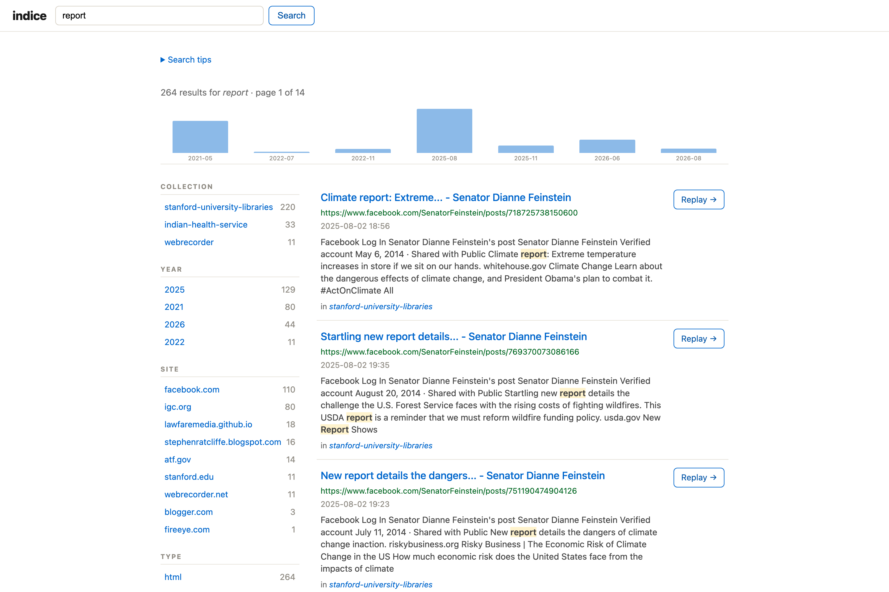

The search box matches page titles, headings, body text, descriptions, keywords, author, and words from the page URL. A few things worth knowing (there's also a "Search tips" panel in the app itself):

- **All words must match.** `climate policy` finds pages containing both words. Use `OR` for either (`climate OR weather`) and `-` to exclude (`climate -policy`).
- **Quotes** search an exact phrase: `"climate policy"`.
- **Field search**: `title:climate` and `author:hopper` match those fields; `site:example.com` matches a whole site across subdomains while `domain:www.example.com` is an exact host; `year:2021` (or `year:[2020 TO 2023]`), `month:202103`, and `modified:2015` (Last-Modified year) filter by date; `type:pdf`, `lang:en`, `status:200`, and `collection:demo` filter by media type, language, HTTP status, and collection.
- **Grouping and boosting**: `(climate OR weather) risk`, and `climate^2 change` ranks "climate" matches higher.

Title matches rank above body matches, and searches are case-insensitive.

The results page is faceted: a sidebar shows counts by collection, year, site, type, and language, and clicking one refines the search (applied filters appear as removable chips). A month timeline sits above the results — click a bar to filter to that month. Repeat captures of the same URL collapse into a single result marked "captured N times", and results are paginated. The homepage also offers "browse by year" and "top sites" entry points into search.

## Crawl thumbnails

Crawls carry a representative image, cached as a small thumbnail at index time. It's taken from the crawl's home-page `og:image`; failing that, the largest content image the page embeds; and failing *that* — for JS-rendered sites whose saved HTML lists no images — the largest captured image on the crawl's own domain (skipping icons/sprites and full-res originals). Homepage collection cards and the crawl detail page show one; the collection detail page shows a grid of its member crawls, each with its own image — conveying that a collection spans multiple crawls of multiple sites. Crawls without an image fall back to a CSS placeholder. A curator can pin a specific image with `indice crawl set <crawl-id> --image <file>` (kept across reindexing).
