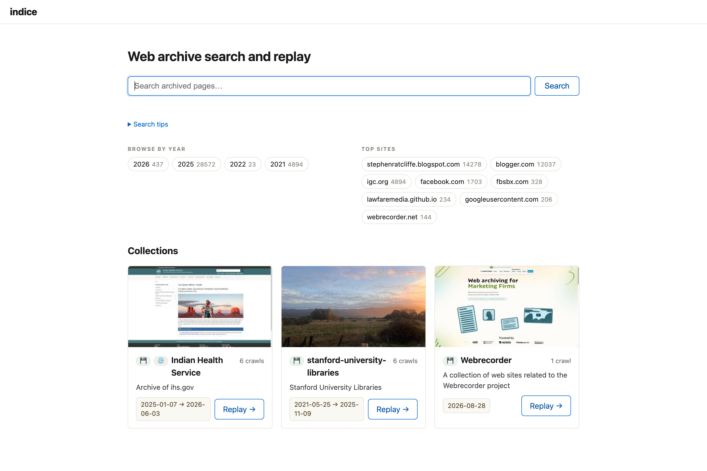

## Try it in a minute

The prebuilt archive includes `apod.wacz` — a small sample crawl of NASA's Astronomy Picture of the Day. Index it into a collection, then start the server:

```sh
indice index --collection "APOD" apod.wacz   # build the search index from the sample
indice serve                                 # http://127.0.0.1:8080
```

Open <http://127.0.0.1:8080> and you can full-text search the captured pages, narrow by the facets, and replay the archived site in your browser. Point `indice index` at your own `.wacz` files the same way (local paths or `http(s)://` URLs); `indice serve --manage` adds an in-browser interface for adding and curating crawls — see [Manage &amp; curate](/indice/docs/guides/manage/).



## The home directory

indice keeps everything under a **home directory** (default: the current directory):

```
<home>/
├── archive/<slug>/     your WACZ files, organized by collection
├── collections/<slug>/ finding aids you author + commit (README.md, thumbnails, notes)
└── index/              search index + derived metadata (rebuildable; git-ignore it)
```

The `collections/` folder is the part worth keeping in version control — the prose and images a curator writes. `index/` is derived from the WACZs and rebuilt by `indice reindex`, so a home in git typically `.gitignore`s `/index`.

## Index and serve

Index one or more WACZ files into a collection, then serve:

```sh
indice index my-archive.wacz --collection "My Web Archive"   # files it into archive/my-web-archive/
indice serve                                                 # http://127.0.0.1:8080
```

Every crawl belongs to a **collection**, so `index` requires `--collection <NAME>` (created if new). This is a deliberate nudge to say what a crawl is a part of and why you're keeping it — the curatorial context indice is built to surface. Describe a collection further (creator, dates, rights, a scope note) with [`indice collection set`](/indice/docs/reference/cli/), which writes a git-committable finding aid at `collections/<slug>/README.md`.

A local WACZ can live anywhere — `indice index path/to/foo.wacz --collection "Bar"` files it into `<home>/archive/bar/` for you (**moving** it if it's already under `archive/`, **copying** it otherwise, so your original is left intact). The source is stored relative to home, so you can move or copy the whole `<home>` directory to another disk or machine and it still works. Point at a different home with `--home <DIR>` (every command takes it).

`index` takes one or more archived WACZ files or `http(s)` URLs, so you can also index a single file or a remote WACZ:

```sh
indice index archive/my-archive.wacz --collection "My Web Archive"
indice index https://example.org/site.wacz --collection "My Web Archive"
```

To rebuild the index later from what you've already indexed, use [`indice reindex`](/indice/docs/reference/cli/) instead of re-listing everything.

Open <http://127.0.0.1:8080/>, search, and click a result to replay it.

(If you built from a clone instead of installing, use `./target/release/indice` in place of `indice`.)

Re-running `index` **skips** sources already indexed into a collection, so a large or interrupted ingest is safe to re-run — it resumes where it left off. Pass `--force` to re-index (refresh) a source that's already there.

## Remote WACZ files

A WACZ can also live at an `http(s)` URL. For example, this one is hosted on S3:

```sh
indice index https://edsu-webarchives.s3.amazonaws.com/docnow.wacz --collection "DocNow"
indice serve
```

By default indice **streams** a remote WACZ. It never downloads the whole file. Using the WACZ's internal CDX index, it reads (via HTTP range requests) only the pieces it needs: the ZIP central directory, the CDX, and the HTML/PDF page records. It skips images, video, JS, and CSS entirely. On a media-heavy archive the indexable text is a tiny fraction of the WACZ: a 323 MB WACZ can be indexed in a few seconds. The URL is recorded as the source, and at replay time the browser reads the remote WACZ directly (also via range requests).

For this to work the remote host must serve the WACZ with **HTTP range support and CORS** allowing indice's origin. The S3 bucket above is configured that way (`Accept-Ranges: bytes` and `Access-Control-Allow-Origin: *`), which is why S3 and other object stores work with no special support — expose the object as a range- and CORS-capable HTTPS URL (public or presigned) and index it.

If you'd rather keep a **local copy**, add `--download`:

```sh
indice index --download https://edsu-webarchives.s3.amazonaws.com/docnow.wacz --collection "DocNow"
```

This fetches the WACZ into `<home>/archive`, indexes it as a local file, and records a whole-file SHA-256 — a durable copy you can replay offline and check with `indice verify`. indice also falls back to downloading automatically if a remote host doesn't support range requests, or if the WACZ stores its WARCs compressed (the WACZ spec says the `archive/` WARCs *should* be stored uncompressed so they can be read by range; a few tools don't).

Streaming a large remote WACZ makes one HTTP range request per page record. Those requests are latency-bound and independent, so indice fetches them concurrently (4 at a time by default — gentle on arbitrary hosts; raise it, e.g. `--concurrency 16`, for object stores like S3). Fetches retry transient failures (rate limits and `5xx`) with backoff, honoring `Retry-After`, so a long ingest survives blips and stays gentle on the host — be mindful that a high `--concurrency` all hits a single host, so dial it down for small servers. As a backstop the worker count is capped at 64 per host, so a mis-typed value can't flood a single server. `index` shows a progress bar — a spinner while it reads the CDX, then a bar with the throughput and an ETA once it knows how many records there are. Add `-v`/`--verbose` for detailed logs instead of the bar; when output isn't a terminal (piping to a file or CI) it prints plain log lines and no bar.

For the details of how indice reads a WACZ (CDX-guided vs. full scan), see [How indice works](/indice/docs/reference/how-it-works/#how-indexing-reads-a-wacz).
